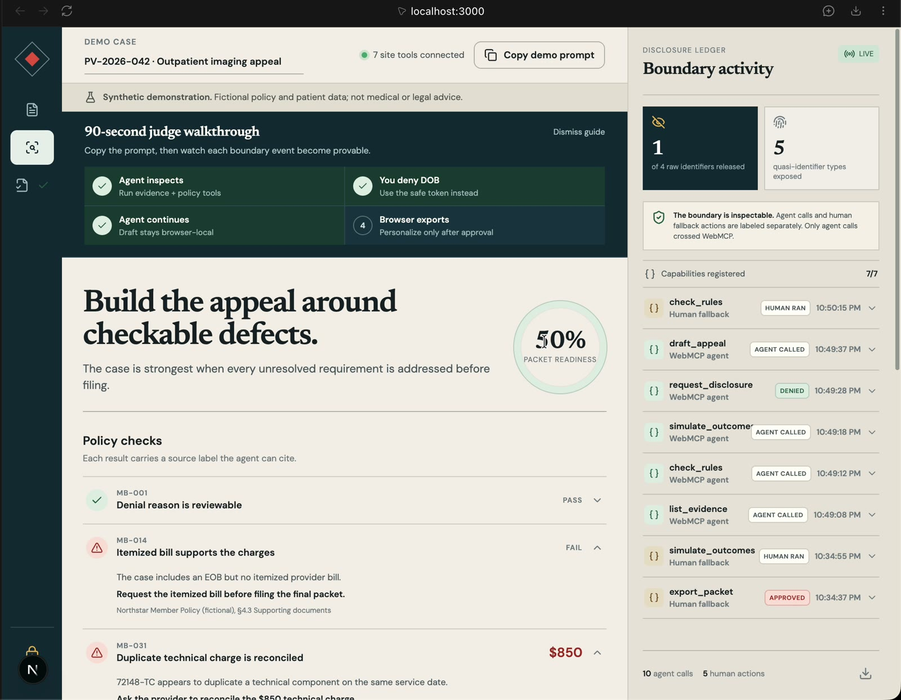
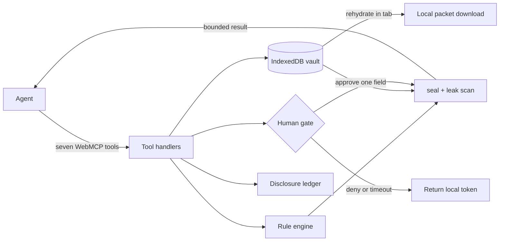

# PaperVeil

**The agent gets capabilities, not your identity.**

PaperVeil is a local-first medical-claim appeal desk built for the 2026 OpenAI WebMCP Challenge. It gives an agent seven narrow tools for checking two fictional case packs, comparing evidence scenarios, and preparing an appeal—while raw identity remains in IndexedDB unless the user approves one explicit disclosure.

**[Launch the live demo](https://paperveil-two.vercel.app)** · [Read the submission notes](./docs/SUBMISSION.md) · [Watch the demo flow](./docs/VIDEO_SCRIPT.md)



> Synthetic demonstration only. The policy, patient, insurer, and claim are fictional. PaperVeil is not medical or legal advice and does not promise an appeal outcome.

## At a glance

| | |
| --- | --- |
| **Problem** | Claim appeals require useful reasoning over highly sensitive records. |
| **Approach** | Keep the case in the browser and expose seven narrowly scoped WebMCP capabilities. |
| **Privacy boundary** | Raw identifiers cannot enter a tool result unless the user approves that exact field. |
| **Human control** | Disclosure and personalized export each require an explicit browser-side decision. |
| **Auditability** | The ledger records tool arguments, exact bounded results, bytes, identifier classes, and gate decisions. |
| **Stack** | Next.js 16, React 19, TypeScript, IndexedDB, WebMCP, Vitest, and Playwright. |

## Why this use case is a strong fit for WebMCP

Claim appeals combine structured reasoning with extremely sensitive documents. A remote tool server normally requires those documents to leave the browser. PaperVeil instead exposes browser-local capabilities: the agent asks the page to run rules, search line items, compare scenarios, and save an argument structure.

The WebMCP boundary becomes a disclosure boundary. Every event is labeled as either a WebMCP agent call or a human fallback action. Agent rows show their arguments, exact result, byte count, raw fields released, quasi-identifier categories exposed, and human-gate decision; tool registrations are summarized separately.

The need is concrete. KFF reports that Marketplace insurers denied 19% of in-network claims in 2024; fewer than 1% of denied claims were appealed, and insurers upheld 66% of the appeals that were filed. [Read the KFF analysis](https://www.kff.org/patient-consumer-protections/claims-denials-and-appeals-in-aca-marketplace-plans-in-2024/). CMS explains that many consumers have rights to internal appeal and, where applicable, external review. [Read the CMS guidance](https://www.cms.gov/cciio/resources/fact-sheets-and-faqs/appeals06152012a).

## How it creates a better user experience

The human and agent work on the same live case state:

- The agent finds a missing itemized bill, unsigned referral, and suspected $850 duplicate charge.
- The human sees those findings immediately in the strategy workspace.
- The agent can ask for one raw field through `request_disclosure`.
- Denial does not break the flow: the tool returns `[[DOB]]` and the agent continues.
- `draft_appeal` stores the prose locally and returns only a receipt.
- `export_packet` substitutes identity in the tab and downloads locally after confirmation.

The interface is fully useful without WebMCP, so the integration is a progressive enhancement rather than a replacement for the human workflow.

## What people and agents can do together that was difficult or impossible before

PaperVeil turns disclosure into a negotiation. The agent can do the high-leverage reasoning while the user decides, field by field, whether identity is actually necessary. The persistent ledger makes the result auditable rather than relying on a privacy promise.

The product makes a deliberately narrow claim: **raw identifiers do not enter a site-tool result unless the user approves that field**. Dates, billing codes, and amounts can still be quasi-identifiers, so PaperVeil counts and labels them instead of claiming anonymity or HIPAA compliance. Raw values may also become visible on the page if the user chooses “Reveal locally”; the guarantee concerns the WebMCP tool-result boundary.

## How I implemented WebMCP

PaperVeil uses the imperative API from the top-level page. All seven definitions live in [`lib/webmcp/register.ts`](./lib/webmcp/register.ts) and reuse the same domain functions as the human interface.

```ts
if (typeof document.modelContext?.registerTool === "function") {
  await document.modelContext.registerTool({
    name: "check_rules",
    description: "Evaluate the fictional policy pack against local evidence.",
    inputSchema: {
      type: "object",
      properties: {},
      additionalProperties: false,
    },
    annotations: {
      readOnlyHint: false,
      destructiveHint: false,
      idempotentHint: true,
    },
    execute: async () => handlers.check_rules({}),
  });
}
```

### The seven tools

| Tool | Contract |
| --- | --- |
| `list_evidence` | Metadata, tokenized summaries, or evidence gaps |
| `find_line_items` | Paginated codes and amounts without raw identity |
| `check_rules` | Compact issues plus fictional policy source labels |
| `simulate_outcomes` | One-to-four non-mutating evidence scenarios |
| `draft_appeal` | Saves a tokenized draft and returns only a receipt |
| `request_disclosure` | Promise-suspended approval with a 20-second auto-deny |
| `export_packet` | Local substitution and download; returns only a receipt |

### The disclosure boundary

Every result passes through `seal(payload, allowedRawFields, rawIdentifiers)`. The function rejects token maps and scans nested serialized output for known raw values. `request_disclosure` is the only contract that can allow one raw field.



### Run it locally

Requirements: Node.js 20.9 or newer and a modern browser.

```bash
npm install
npm run dev
```

Open [http://localhost:3000](http://localhost:3000). No API key, backend, or account is required.

```bash
npm test
npm run test:e2e
npm run build
```

### Testing instructions for judges

1. Open the deployed app directly in ChatGPT's in-app browser.
2. Use GPT-5.6 Sol or GPT-5.6 Terra; site tools are currently disabled on Luna.
3. Confirm **Enable site tools** is on under **Settings → Browser → Permissions**.
4. Copy the deterministic judge prompt from the app and send it. It asks the agent to inspect the case, compare scenarios, request only DOB to demonstrate the gate, and continue with a token after denial.

   > Use the PaperVeil site tools to review this denied claim. First list the evidence and run the policy checks. Compare filing now with adding the missing evidence and reconciling any duplicate charge. Then request only date_of_birth for the appeal header so I can demonstrate the privacy gate. If I deny it, continue with [[DOB]] and draft the appeal anyway. Do not request any other raw identifier and do not export until I ask.

5. When `request_disclosure` asks for date of birth, click **Deny · use token**.
6. Open the Packet view and compare the receipt, tokenized local draft, and optional local reveal.
7. Expand the latest ledger entry to inspect the exact returned bytes.
8. Switch to the second synthetic case from the case selector to verify that the same seven tools operate on a different evidence profile.

For Chrome testing, enable `chrome://flags/#enable-webmcp-testing` and use the Model Context Tool Inspector extension. ChatGPT currently requires imperative registration in the top-level page; declarative and iframe-registered tools are not discovered. [Official OpenAI site-tools documentation](https://learn.chatgpt.com/docs/webmcp)

## Privacy and threat-model limits

- Disclosure minimization is not anonymity.
- Page-visible content may be available to browser inspection even when it was not returned by a site tool.
- The demo uses fictional records and does not parse real documents.
- The rule pack illustrates procedural checking and is not authoritative policy guidance.
- IndexedDB is local browser storage, not an encrypted medical-record vault.

## License

[MIT](./LICENSE)
