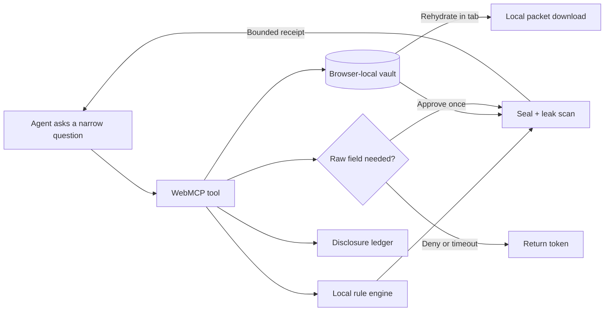

<p align="center">
  
</p>

<h1 align="center">PaperVeil</h1>

<p align="center"><strong>The agent gets capabilities, not your identity.</strong></p>

<p align="center">
  A local-first medical-claim appeal desk built for the 2026 OpenAI WebMCP Challenge.
  PaperVeil lets an AI reason through a denied claim while raw identity stays inside the browser.
</p>

<p align="center">
  <a href="https://paperveil-two.vercel.app"><strong>Launch the live demo →</strong></a>
  &nbsp;·&nbsp;
  <a href="./docs/SUBMISSION.md">Submission notes</a>
  &nbsp;·&nbsp;
  <a href="./docs/VIDEO_SCRIPT.md">Demo script</a>
</p>

<p align="center">
  
  
  
  
  
</p>


> **Core guarantee:** raw identifiers do not enter a site-tool result unless the user approves that exact field. If disclosure is denied or times out, the workflow continues with a token such as `[[DOB]]`.

> [!NOTE]
> PaperVeil uses fictional policies, patients, insurers, and claims. It is a technical demonstration—not medical or legal advice, a HIPAA-compliant records system, or a promise of appeal success.

## Judge it in 90 seconds

1. Open the **[live PaperVeil desk](https://paperveil-two.vercel.app)** in ChatGPT's in-app browser.
2. Click **Copy demo prompt**, paste it into the conversation, and let the agent use the site tools.
3. Watch it list evidence, run policy checks, and compare filing now against completing the packet.
4. When PaperVeil asks for `date_of_birth`, choose **Deny · use token**.
5. The appeal still gets drafted with `[[DOB]]`; no raw identifier enters the result.
6. Open **Disclosure ledger → latest entry** to inspect arguments, exact result bytes, identifier classes, and the gate decision.

The deterministic prompt is:

> Use the PaperVeil site tools to review this denied claim. First list the evidence and run the policy checks. Compare filing now with adding the missing evidence and reconciling any duplicate charge. Then request only date_of_birth for the appeal header so I can demonstrate the privacy gate. If I deny it, continue with [[DOB]] and draft the appeal anyway. Do not request any other raw identifier and do not export until I ask.

## Why this matters

Claim appeals need high-context reasoning over some of a person's most sensitive data. A conventional remote tool server often requires those records to leave the browser before the agent can help. PaperVeil reverses that model:

| Conventional workflow | PaperVeil |
| --- | --- |
| Send documents to a remote service | Keep the synthetic case in browser-local IndexedDB |
| Give the model broad document access | Expose seven narrow, schema-defined capabilities |
| Treat consent as a one-time checkbox | Ask for one field, for one stated reason, at the moment of need |
| Fail when access is denied | Return a placeholder and keep working |
| Rely on a privacy promise | Record inspectable arguments, outputs, bytes, and decisions |
| Return a personalized document to the agent | Rehydrate and download the packet locally in the tab |

The need is concrete: KFF reports that Marketplace insurers denied 19% of in-network claims in 2024, while fewer than 1% of denied claims were appealed. CMS explains that many consumers have rights to internal appeal and, where applicable, external review. See the [KFF analysis](https://www.kff.org/patient-consumer-protections/claims-denials-and-appeals-in-aca-marketplace-plans-in-2024/) and [CMS guidance](https://www.cms.gov/cciio/resources/fact-sheets-and-faqs/appeals06152012a).

## What the demo proves

| Evaluation question | PaperVeil's answer |
| --- | --- |
| **Is WebMCP essential?** | Yes. The agent operates on live browser-local state without requiring a remote claim-data service. |
| **Is the tool surface bounded?** | Seven tools have narrow schemas, pagination or result caps, and explicit contracts. |
| **Can the user say no?** | Disclosure denial and 20-second timeout both return a token instead of stopping the task. |
| **Is sensitive output controlled?** | Every result passes through a seal and known-value leak scan. |
| **Can a judge verify the boundary?** | The ledger separates WebMCP calls from human fallback actions and exposes exact receipts. |
| **Does it work without agent support?** | Yes. The same domain functions power the complete human interface. |
| **Can the concept generalize?** | The capability-not-data pattern also fits finance, legal, HR, and other sensitive local workflows. |


## The product loop



The human and agent share one live case state. The agent can find a missing itemized bill, an unsigned referral, and a suspected duplicate charge; compare evidence strategies; request one field; and save a tokenized draft. The user sees each effect immediately and retains control over disclosure and export.

## Seven narrowly scoped site tools

All definitions live in [`lib/webmcp/register.ts`](./lib/webmcp/register.ts). The site tools and human interface reuse the same handlers, rules, vault, and ledger.

| Tool | What it can do | Privacy behavior |
| --- | --- | --- |
| `list_evidence` | List metadata, tokenized summaries, or evidence gaps | No raw identity |
| `find_line_items` | Search paginated codes and amounts | Bounded results; no raw identity |
| `check_rules` | Evaluate the fictional policy pack | Returns compact issues and source labels |
| `simulate_outcomes` | Compare one to four evidence scenarios | Non-mutating |
| `draft_appeal` | Save a tokenized appeal locally | Returns only a receipt |
| `request_disclosure` | Ask for exactly one raw field | Human gate; 20-second auto-deny |
| `export_packet` | Rehydrate and download in the browser | Human gate; returns only a receipt |

### Registration pattern

```ts
if (typeof document.modelContext?.registerTool === "function") {
  await document.modelContext.registerTool({
    name: "check_rules",
    description: "Evaluate the fictional policy pack against local evidence.",
    inputSchema: {
      type: "object",
      properties: {},
      additionalProperties: false,
    },
    annotations: {
      readOnlyHint: false,
      destructiveHint: false,
      idempotentHint: true,
    },
    execute: async () => handlers.check_rules({}),
  });
}
```

## Privacy boundary

Every result passes through `seal(payload, allowedRawFields, rawIdentifiers)`. The seal rejects token maps and recursively scans serialized output for known raw values. Only `request_disclosure` can authorize one named field, and only after a browser-side decision.

PaperVeil makes a narrow, testable claim—not a vague claim of anonymity:

- Raw identifiers stay out of site-tool results unless the user approves the requested field.
- Dates, billing codes, and amounts may still be quasi-identifiers, so the ledger counts and labels them.
- **Reveal locally** can display raw values in the page; that does not return them through a tool result.
- Personalized packet generation happens in the browser after a separate export confirmation.

## Agent quick context

For an AI agent inspecting this repository:

- Start with [`lib/webmcp/register.ts`](./lib/webmcp/register.ts) for the public capability surface.
- Follow handlers into [`lib/webmcp/handlers.ts`](./lib/webmcp/handlers.ts).
- Inspect [`lib/vault/redaction.ts`](./lib/vault/redaction.ts) for the output seal and token rehydration.
- Inspect [`lib/webmcp/human-gate.ts`](./lib/webmcp/human-gate.ts) for browser-side approval and timeout behavior.
- Inspect [`lib/rules/engine.ts`](./lib/rules/engine.ts) for deterministic fictional policy evaluation.
- Run `npm test`, `npm run test:e2e`, and `npm run build` before changing a tool contract.

Important invariants:

1. Never add a raw identifier to a normal tool result.
2. Denial and timeout must remain non-blocking.
3. Export must remain local and separately confirmed.
4. Human fallback actions and WebMCP calls must remain distinguishable in the ledger.
5. Tool schemas must stay bounded and reject unexpected properties.

## Run locally

Requirements: **Node.js 20.9+** and a modern browser. No API key, backend, database server, or account is required.

```bash
git clone https://github.com/RajvardhanPatil07/paperveil.git
cd paperveil
npm install
npm run dev
```

Open [http://localhost:3000](http://localhost:3000).

### Verify the project

```bash
npm test          # unit and contract tests
npm run test:e2e # responsive workflow, privacy gate, keyboard, and reset tests
npm run lint
npm run build
```

For Chrome testing, enable `chrome://flags/#enable-webmcp-testing` and use the Model Context Tool Inspector extension. ChatGPT currently discovers imperative registrations from the top-level page. See the [official OpenAI site-tools documentation](https://learn.chatgpt.com/docs/webmcp).

## Repository map

```text
app/                 Next.js application shell and responsive visual system
components/          Claim desk, privacy gate, ledger, and shared UI
fixtures/            Two synthetic claim and policy packs
lib/domain/          Domain types
lib/rules/           Deterministic fictional policy engine
lib/vault/           IndexedDB state, redaction, sealing, rehydration
lib/webmcp/          Tool contracts, handlers, registration, human gates
tests/unit/          Rule, store, registration, and tool-contract tests
tests/e2e/           Full browser workflows across three viewport profiles
docs/                Submission notes and narrated demo script
```

## Limits and threat model

- Disclosure minimization is not anonymity.
- Page-visible content may be available to browser inspection even when it was not returned by a site tool.
- The demo does not parse or accept real medical records.
- The fictional policy pack is not authoritative coverage guidance.
- IndexedDB is browser-local storage, not an encrypted medical-record vault.
- Production use would require authentication, encryption, retention controls, threat modeling, compliance review, and insurer-specific policy sources.

## Built with

[Next.js 16](https://nextjs.org/) · [React 19](https://react.dev/) · [TypeScript](https://www.typescriptlang.org/) · IndexedDB · WebMCP · [Vitest](https://vitest.dev/) · [Playwright](https://playwright.dev/)

## License

Released under the [MIT License](./LICENSE).
